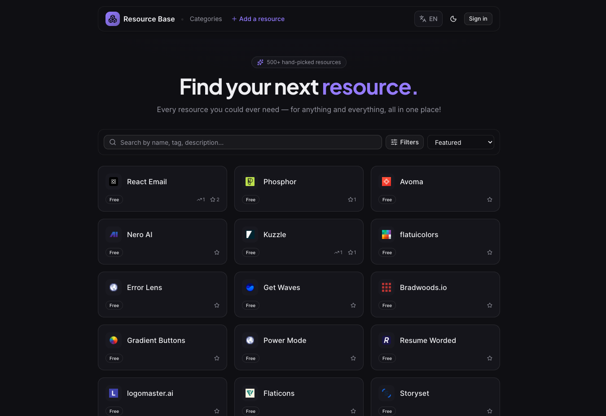

# Resource Base

A curated, searchable directory of the best resources for **development**, **design**, and — over time — anything else worth collecting. Browse ~500 hand-picked tools, libraries and references across a multi-level category and tag taxonomy, search them instantly, save your favorites, and suggest improvements. Built as a real, production application in **5 languages** with full control over design and data.



## Features

| Feature | Signed out | Signed in | How it works |
| --- | :---: | :---: | --- |
| **Browse & filter** | ✅ | ✅ | Explore by category, tag, pricing and language; sort by featured, popularity, favorites, name or recency. |
| **Instant search** | ✅ | ✅ | A self-built ⌘K command palette with fuzzy matching across every resource, category and tag — no third-party search service. |
| **Resource details** | ✅ | ✅ | Each resource has a deep-linkable, shareable page with full description, taxonomy, related resources and rich SEO/OG metadata. |
| **Favorites** | — | ✅ | Save resources to your account and revisit them on a dedicated page. |
| **Submit a resource** | — | ✅ | Suggest a new resource; every submission is reviewed before going live. |
| **Suggest edits** | — | ✅ | Propose better categories, tags or a clearer description for any resource — reviewed, then applied automatically on approval. |
| **Notifications** | — | ✅ | Get notified when your submission or suggestion is approved or needs changes. |
| **Your data** | — | ✅ | Export everything you've contributed as JSON, or permanently delete your account — self-service (GDPR / KVKK). |

> Content lives in a headless CMS, so resources are added, fixed and re-categorised without shipping code. A daily cron quietly checks every link and flags the broken ones for review.

## How it works

- **Browsing & search** are fully public and instant. Filters and the ⌘K palette run client-side over a tag-cached dataset, so navigating between categories, tags and resources feels immediate.
- **Signing in** (Google, GitHub, or email) unlocks the personal layer — favorites, submissions, suggestions and notifications — all scoped to your own account.
- **Submitting & suggesting** never touch the live directory directly. Your contribution is stored as a moderated submission; an editor reviews it, and on approval the change is applied to the resource automatically and you're notified.
- **Content updates go live without a redeploy** — a CMS webhook revalidates just the affected pages on demand.

## Languages

The entire interface is available in **English, Turkish, Spanish, French and German**, switchable from the header. Your choice is remembered.

## Tech stack

- **Next.js (App Router) + React + TypeScript** — the application
- **Tailwind CSS + shadcn/ui + Radix** — design system and accessible primitives
- **Sanity** — headless CMS for resources, categories, tags and submissions (Studio embedded at `/studio`)
- **Better Auth** — authentication (Google/GitHub/GitLab OAuth + email/password with required email verification and password reset)
- **Cloudflare Turnstile** — bot protection on the account-creation and email-sending endpoints
- **Cloudflare D1 + Drizzle ORM** — user data (profiles, favorites, submissions, notifications)
- **cmdk + Fuse.js** — the self-built command palette and fuzzy search
- **Cloudflare Workers (via OpenNext)** — hosting; **KV** for the ISR page cache, a **Durable Object** queue for revalidation, **Email Sending** for password-reset mail, a separate **Cron Trigger** Worker for the broken-link checker, and **Web Analytics**

## Privacy & security

- **Your data is scoped to you.** Every read and write of user data (profile, favorites, submissions, notifications) goes through a server action / route handler that derives the user from the verified session and filters by their id, so one account can never read or modify another's data.
- **Secrets stay on the server.** Auth secret, database binding and CMS write tokens live only in server-only modules / Worker bindings and never reach the browser.
- **Hardened by default.** A strict Content-Security-Policy, HSTS, `X-Frame-Options`, `nosniff` and a safe-redirect auth callback ship in the production config. Webhooks are signature-verified; the link-checker cron is secret-gated and fails closed.
- **Email sign-up is verified and abuse-resistant.** New email/password accounts must confirm their address before they can sign in (OAuth is unaffected). The endpoints that create accounts or send mail are layered against spam / "denial of wallet": **Cloudflare Turnstile** blocks bots up front, **per-recipient** cooldown + hourly/daily caps stop mailbox bombing even across rotating IPs, Better Auth's **per-IP** rate limits sit on top, and a **global daily cap** is the final circuit breaker. When a limit is hit the user gets a clear message rather than a silent failure.
- **Write endpoints are rate-limited.** The public click counter (per IP + resource) and the favorite-toggle and username-change actions (per user) are throttled in KV — shared across isolates and persistent, so the limits hold across cold starts. Thresholds sit far above real usage, so they only ever bite scripted abuse (inflating click counts, hammering D1 writes), never a real visitor.
- **You're in control of your data.** Export a full JSON copy of everything you've contributed, or delete your account permanently — both self-service, no email required (GDPR Art. 17 & 20 / KVKK).
- **Analytics are privacy-respecting** and gated behind cookie consent.

## Local development

1. Copy the env template and fill in your values:
   ```bash
   cp .env.example .env.local
   ```
   Public/build variables go in `.env.local`; server secrets for the Worker go in `.dev.vars` (gitignored). See `.env.example` for the full, documented list:
   - `NEXT_PUBLIC_SANITY_PROJECT_ID`, `NEXT_PUBLIC_SANITY_DATASET`, `NEXT_PUBLIC_SITE_URL`
   - `SANITY_API_READ_TOKEN` (Viewer) and `SANITY_API_WRITE_TOKEN` (Editor)
   - `SANITY_REVALIDATE_SECRET`, `SANITY_NOTIFY_SECRET`, `CRON_SECRET`
   - `BETTER_AUTH_SECRET`, `BETTER_AUTH_URL`, and the Google/GitHub/GitLab OAuth client id+secret pairs
   - `EMAIL_FROM` (verified sender), and optionally `NEXT_PUBLIC_TURNSTILE_SITE_KEY` + `TURNSTILE_SECRET_KEY` for bot protection

   > **Turnstile is optional locally.** Leave the two `TURNSTILE_*` values blank and the captcha widget hides itself while the auth endpoints run unguarded — handy for local dev. Set both (site key as a build variable, secret via `wrangler secret put`) to turn bot protection on in production.
2. Install dependencies and run the dev server:
   ```bash
   pnpm install
   pnpm dev
   ```
3. Open `http://localhost:3000` — the embedded Studio is at `/studio`. To test on the real Workers runtime, use `pnpm cf:preview`.

### Database

User-data schema lives in Drizzle (`lib/db/schema.ts`); migrations are generated into `drizzle/`. Apply them to Cloudflare D1:

```bash
pnpm db:generate           # generate SQL from the schema
pnpm db:migrate:local      # apply to the local D1
pnpm db:migrate:remote     # apply to the production D1
```

### Importing the legacy content

The original markdown lives in `_migration-source/`. To (re)import into Sanity:

```bash
pnpm migrate:dry   # parse + summarise, write nothing
pnpm migrate       # import (idempotent — safe to re-run)
```

## Deploying

Hosted on **Cloudflare Workers** via OpenNext. Pushing to `main` triggers an automatic build + deploy through **Workers Builds** (build command `npx opennextjs-cloudflare build`, deploy command `npx opennextjs-cloudflare deploy`). You can also deploy manually with `pnpm cf:deploy`.

Notes:
- Runtime secrets are set with `wrangler secret put`; the public `NEXT_PUBLIC_*` and Sanity tokens must also be present as **Build variables** in Workers Builds (Next.js inlines them / fetches Sanity at build time).
- Add a Sanity webhook (**sanity.io/manage → API → Webhooks**) pointing at `/api/revalidate` (content revalidation) and `/api/notify` (submission-approval notifications), each sharing its respective secret.
- The broken-link checker runs daily as a separate Cron Trigger Worker (`workers/link-check-cron`).

### Production hardening

Two extra steps lock down the auth endpoints against bot abuse and spam. Both are optional to *run* the app but strongly recommended in production:

1. **Turnstile (bot protection).** In the Cloudflare dashboard go to **Turnstile → Add widget**, add your domain (`resource-base.com`), and copy the two keys. Set `NEXT_PUBLIC_TURNSTILE_SITE_KEY` as a **Build variable** in Workers Builds (it's inlined into the client) and `TURNSTILE_SECRET_KEY` as a runtime secret (`wrangler secret put TURNSTILE_SECRET_KEY`). Once both are present, the auth forms render the widget and Better Auth rejects any sign-up / sign-in / verification / reset request without a valid challenge token. Until they're set, captcha is simply off.

2. **WAF rate limiting (network layer).** This stops floods *before* they reach the Worker, so they never cost you compute. It's a dashboard setting, not code. In the Cloudflare dashboard go to **Security → WAF → Rate limiting rules → Create rule** and guard the auth endpoints (the highest-value target):
   - **Field / match:** `URI Path` `contains` `/api/auth/`
   - **Rate:** `10` requests per `10 seconds` per client IP
   - **Action:** `Block` for `10 seconds`

   This is defense-in-depth on top of the in-app per-IP and per-recipient limits. The Free plan allows **one** rate-limiting rule, so spend it on `/api/auth/`. On a paid plan you can add a second, looser rule on all API routes (`URI Path contains /api/`, e.g. `100` requests per `10 seconds`, action `Managed Challenge`) — but it's optional: the click counter, favorite toggles and username changes are already KV-rate-limited per IP/user in-app, and Cloudflare's automatic DDoS protection covers volumetric floods on every plan.

## Disclaimer

Resource Base is an independent directory. Listed resources are the property of their respective owners and are linked for discovery; inclusion does not imply any affiliation or endorsement.

## Feedback & contact

- **Found a bug or want to suggest a resource the directory is missing?** Open an issue, or submit it right inside the app.
- **Anything else?** Email **emreerden@pm.me** or visit [emreerden.dev](https://emreerden.dev).

---

Created by [Emre Erden](https://emreerden.dev).
